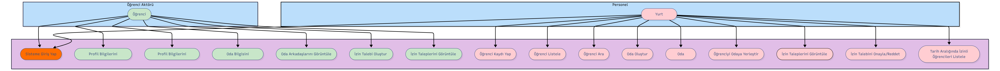
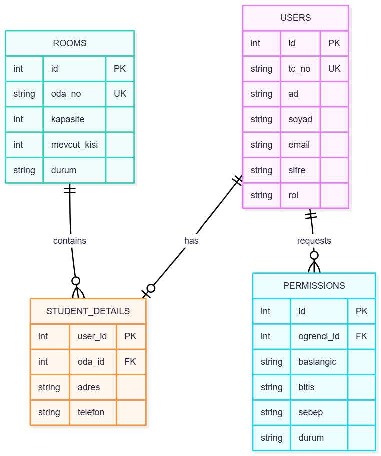
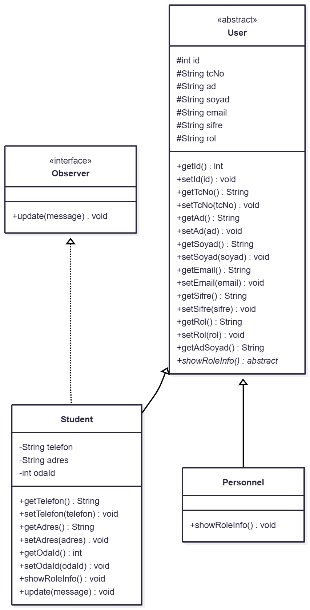

# Yurt Yönetim Sistemi

Bu proje, **Kırklareli Üniversitesi Yazılım Mühendisliği** Bölümü "Yazılım Mimarisi ve Tasarımı" dersi dönem projesi olarak geliştirilmiştir. **PRJ-2 Yurt Yönetim Sistemi** konusunu kapsar. Yurt idaresinin günlük işlemlerini dijital ortamda verimli bir şekilde yönetmesini sağlar.

## 👨‍💻 Proje Ekibi
*   **Ad Soyad:** Ümit SENCER 
*   **Ad Soyad:** Yusuf İslam Sözen             [https://github.com/YusufSozen]
*   **Ad Soyad:** Azo İSMAİL                    [https://github.com/Azo15]  

---

## 🏗️ Kullanılan Tasarım Desenleri (Design Patterns)
Projede yönergede istenen **zorunlu 4 desen** ve **ekstra desenler** olmak üzere toplam **6 farklı mimari yapı** kullanılmıştır.

1.  **Singleton (Tekil Nesne):** Veritabanı bağlantısı (`DatabaseConnection`) tüm uygulama boyunca tek bir nesne üzerinden yönetilir. Performans ve tutarlılık sağlar.
2.  **Factory (Fabrika):** Kullanıcı giriş yaparken, rolüne göre (Öğrenci/Personel) dinamik nesne üretimi `UserFactory` sınıfı ile yapılır.
3.  **Builder (İnşaatçı):** Çok parametreli öğrenci kayıt işleminde (Ad, Soyad, TC, Tel, vs.), hata yapmayı önlemek ve okunabilirliği artırmak için `StudentBuilder` kullanılmıştır.
4.  **Observer (Gözlemci):** Bir odaya öğrenci atandığında veya önemli bir değişiklik olduğunda, ilgili `Student` nesnesine anlık bildirim (`update`) gönderilir.
5.  **State (Durum):** İzin talepleri bir yaşam döngüsüne sahiptir (`BEKLEMEDE` -> `ONAYLANDI` / `REDDEDILDI`). Bu durum geçişleri `PermissionState` arayüzü ve alt sınıfları ile yönetilir.
6.  **Template Method Mantığı:** `BasePage` soyut sınıfı, tüm arayüz pencereleri için ortak bir şablon (iskelet) oluşturur; alt sınıflar sadece içeriği doldurur.

---

## 📊 UML Diyagramları
Projenin mimari yapısını gösteren diyagramlar aşağıdadır:

### 1. Use-Case Diyagramı (Kullanıcı Rolleri)

### 2. Veritabanı Şeması (ER Diyagramı)

### 3. Class Diyagramı (Sınıf Hiyerarşisi)

### 4. Sequence Diyagramı (İzin Senaryosu)

---

## 🚀 Temel Özellikler

### 👥 Personel (Yönetici) Modülü
*   **Öğrenci İşlemleri:** Yeni kayıt, silme, arama ve listeleme.
*   **Oda Yönetimi:** Toplu oda oluşturma, odaya öğrenci atama ("sürükle-bırak" mantığıyla transfer), oda kapasite kontrolü.
*   **İzin Yönetimi:** Öğrencilerden gelen izin taleplerini görüntüleme, onaylama veya reddetme.
*   **Raporlama:** Geçmişe dönük izinleri ve öğrenci listelerini filtreleme.

### 🎓 Öğrenci Modülü
*   **Profil:** Kendi bilgilerini (Telefon, Şifre vb.) görüntüleme ve güncelleme.
*   **Oda Bilgisi:** Kaldığı odayı ve oda arkadaşlarının iletişim bilgilerini görme.
*   **İzin Talebi:** Belirli tarihler için mazeretli izin isteme ve durumunu (Onay/Red) takip etme.

---

## 🛠️ Teknolojiler
*   **Dil:** Java 17+
*   **Arayüz:** Java Swing (Modern UI)
*   **Veritabanı:** SQLite (Kurulum gerektirmez, gömülü)
*   **Build Aracı:** Maven

---

## 💻 Kurulum ve Çalıştırma

### 1. IntelliJ IDEA ile (Önerilen)
1.  Projeyi indirin ve IntelliJ IDEA ile açın (`pom.xml` dosyasını algılayacaktır).
2.  Sağ altta Maven bağımlılıklarının (SQLite Driver) inmesini bekleyin.
3.  `src/main/java/Main.java` dosyasını açıp **Run** (▶) butonuna basın.

### 🔑 Varsayılan Giriş Bilgileri
Sistem ilk açılışta otomatik veritabanı oluşturur ve **Yönetici** hesabını ekler:
*   **TC / Kullanıcı Adı:** `admin` (veya TC: `10000000000`)
*   **Şifre:** `1453`

> **Not:** TC No ile giriş yapmak isterseniz kod içinde belirlenen (örn: `10000000000`) numarayı kullanabilirsiniz.
